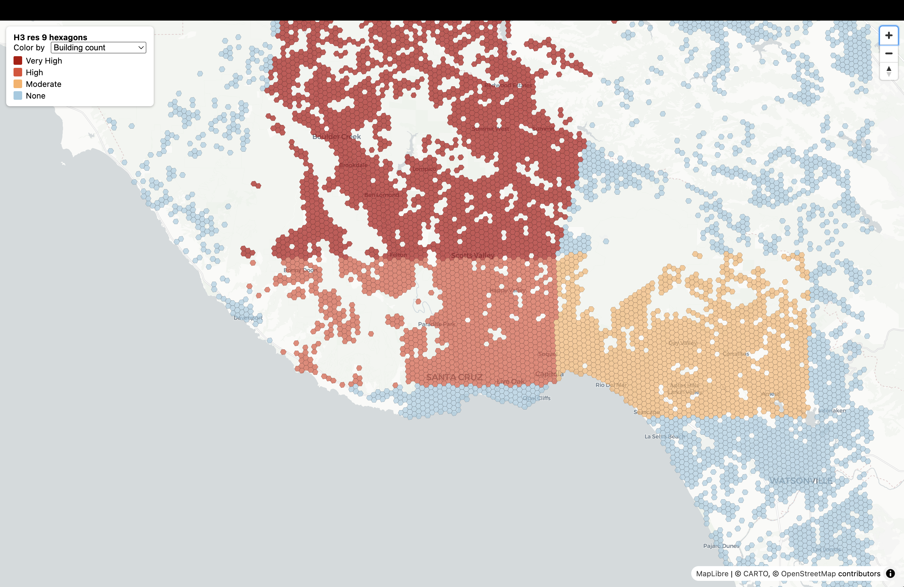
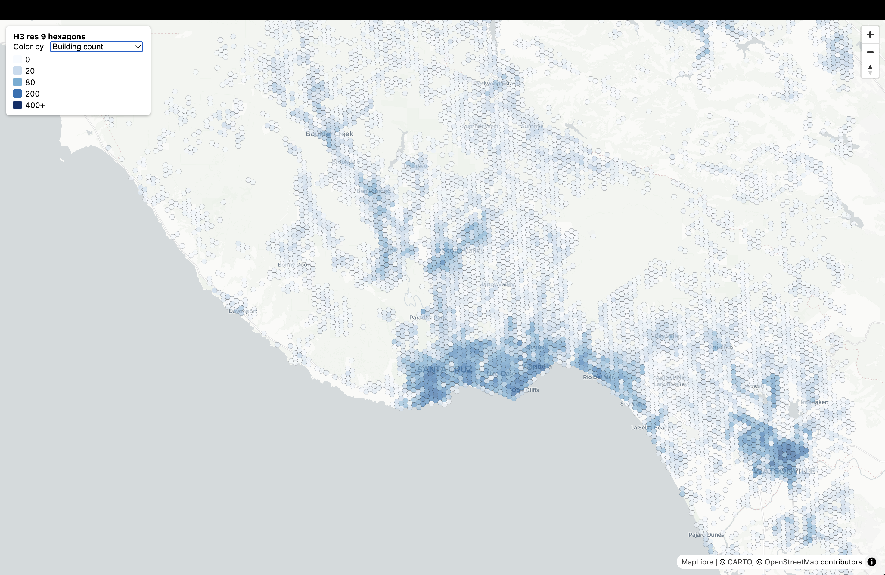
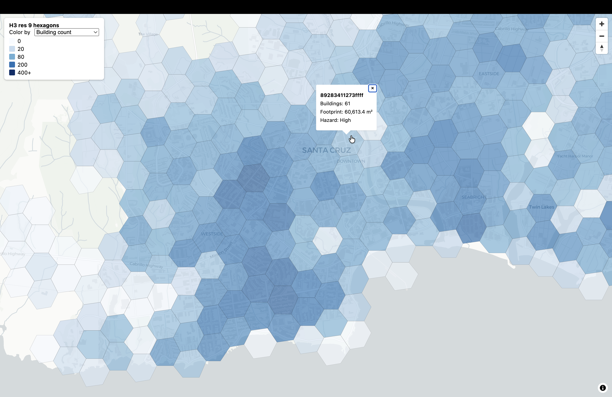

# Cloud-Native Building Footprint Pipeline

A serverless geospatial ETL pipeline that turns Overture Maps building footprints into an H3-indexed, hazard-joined vector tileset, with no database server.

**Stack:** DuckDB (Spatial, httpfs, H3) · Overture Maps GeoParquet on S3 · Uber H3 · Tippecanoe · PMTiles · MapLibre GL JS

## Architecture: Decoupled Compute + Cloud-Native Storage

```text
Overture Maps GeoParquet (S3)
        │
        │  HTTP range requests, bbox pushdown (no full download)
        ▼
DuckDB: centroid → H3 res 9 → GROUP BY
        │
        ▼
h3_agg.parquet
        │
        ▼
DuckDB: spatial join with hazard polygons + benchmark
        │
        ▼
h3_hazard.parquet
        │
        ▼
GeoParquet export → GeoJSONSeq → tippecanoe
        │
        ▼
hex_hazard.pmtiles (static file)
        │
        │  HTTP range requests
        ▼
MapLibre GL JS (static site)
```

- **Storage is files:** Parquet on S3 in, GeoParquet and PMTiles out. Nothing to provision, patch, or back up.
- **Compute is ephemeral:** DuckDB runs in-process on a laptop, CI job, or container, and disappears when done.
- **Why GeoParquet:** columnar and compressed, with bbox statistics that let DuckDB skip irrelevant row groups and fetch only the needed columns and byte ranges.
- **Why H3:** building centroids are snapped to hexagon ids, so the heavy part of the analysis is an integer `GROUP BY`. The polygon-on-polygon join then runs on thousands of hexagons instead of every building footprint, which is where traditional PostGIS workflows spend most of their time.
- **Why PMTiles:** one static file served with range requests, so no tile server is required.

## Setup

Run each block one at a time, in order, from the project root.

**1. Create a virtual environment.** Isolates the project's Python dependencies from your system Python.

```bash
python3 -m venv path/to/venv
source path/to/venv/bin/activate
python3 -m pip install -r requirements.txt
```

**2. Install tippecanoe (v2.17+).** Required to build PMTiles.

```bash
brew install tippecanoe
```

## Run

Run each block one at a time, in order.

**1. Ingest and aggregate.** Queries Overture's public S3 bucket with a Santa Cruz County, CA bounding box, so only the matching byte ranges are read. Converts each building centroid to an H3 res 9 cell and aggregates building count and footprint area per cell. Writes `data/h3_agg.parquet`.

```bash
python src/01_ingest_and_h3.py
```

**2. Join hazard zones and benchmark.** Writes a synthetic wildfire hazard GeoJSON, spatially joins it to the H3 hexagons, times the join over several runs, and writes `data/h3_hazard.parquet`.

```bash
python src/02_hazard_join.py
```

**3. Export tiles.** Writes `data/hex_hazard.geoparquet`, converts it to GeoJSONSeq, then runs tippecanoe to produce `data/hex_hazard.pmtiles`.

```bash
python src/03_export_tiles.py
```

**4. Serve the project.** Starts a local static server from the project root. PMTiles needs HTTP range request support, so `python -m http.server` will not work here.

```bash
npx http-server . -p 8080 --cors
```

**5. Open the map.** Visit this URL in your browser. Use the dropdown to switch between hazard class and building count coloring, and click a hexagon for details.

```text
http://localhost:8080/frontend/
```

## Results

Output of a full run over Santa Cruz County, CA.

| Stage | Result |
|---|---|
| Buildings read from Overture (bbox pushdown) | 309,944 |
| H3 res 9 cells produced | 9,239 |
| Ingest and aggregation time (S3 to Parquet) | 129 s |
| Hazard join time over 9,239 cells, 3 zones (median of 5) | 52 ms |
| Final PMTiles size | 0.58 MB |

### Wildfire hazard view

Hexagons colored by hazard class. This run used the synthetic hazard layer, which is why the zone edges are straight.



### Building density view

Hexagons colored by building count. Density peaks in Santa Cruz, Capitola, and Watsonville.



### Zoomed in with popup details

Zoomed in on downtown Santa Cruz. Clicking a hexagon shows its H3 id, building count, total footprint area, and hazard class.

